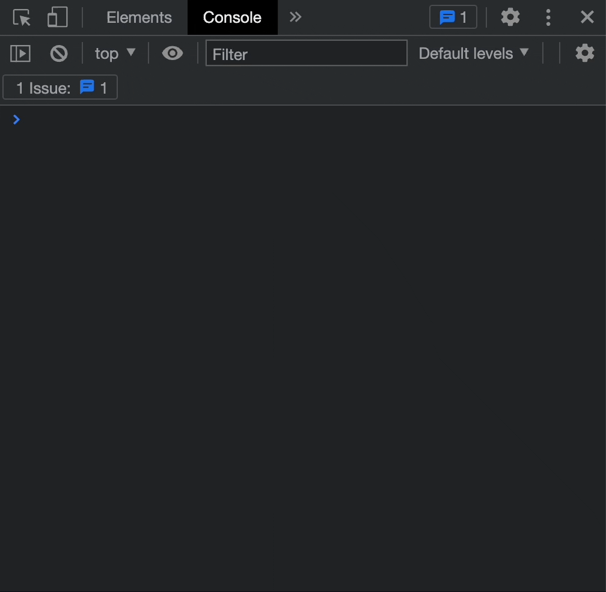

<div align="center">


[link to live app](https://secret-brushlands-01494.herokuapp.com/)


</div>


<div align="left">

## Install

``` bash
% git clone https://github.com/arthurfincham/insta-clone
```

## Usage

#### Go to the project directory and install dependencies:

``` ruby
% bundle install
 ```

#### Create and migrate database:

``` ruby
% rails db:create
 ```
 ``` ruby
% rails db:migrate
 ```
#### Start the Rails server:
 ``` ruby
% bundle exec rails server
 ```
#### See [important note](#Important)

</div>

<br>
<br>


<div align="left">

## Assignment

_Build Instagram: Simple huh!_

* Your challenge is to build Instagram using Rails. 
* You'll need users who can post pictures;
* and users who write comments on pictures and like pictures. 
* Style it like Instagram's website (or more awesome).
* Bonus if you can add filters!

## Tags

* Tags built with the [acts-as-taggable](https://github.com/mbleigh/acts-as-taggable-on) gem.
* Tags are dynamically created from the caption of a post.
* A helper method extracts any strings beginning with '#', then adds them to the post's _tag_list_.

</div>


<br>
<br>

<div align="left">

## Profile Page

* Profile page for user who is logged in.
* Options for a grid layout or a timeline layout. 

## Stack

* framework: [Ruby on Rails](https://rubyonrails.org/)

* styling: [Bootstrap](https://getbootstrap.com/)

* authentication: [Devise](https://github.com/heartcombo/devise)

* image uploading: [Shrine.rb](https://shrinerb.com/)

</div>


<br>


<div align="left">

## Important

If you are viewing the project on a laptop, please open Chrome's DevTools and use a responsive device. This was designed for an iPhone or any other smart device.

On a Mac, press `OPTION` + `COMMAND` + `C`

<br>



</div>